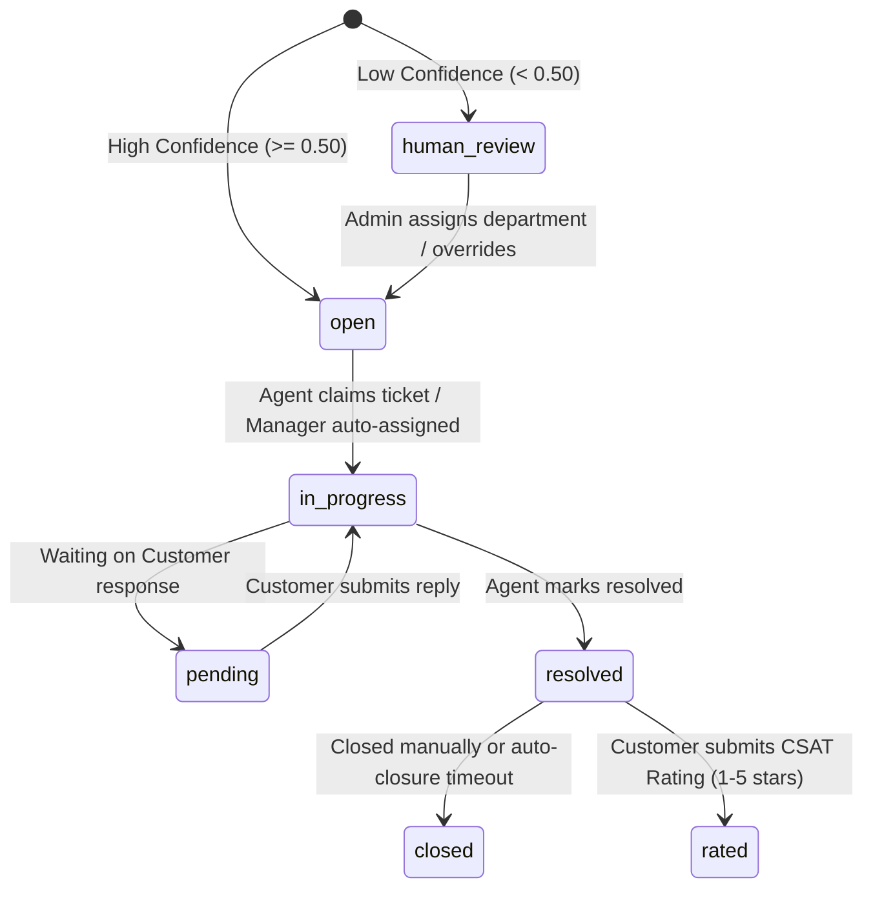

# Product Requirements Document (PRD)
# Deskwise — AI-Based Customer Support Ticket System

| Property | Details |
| :--- | :--- |
| **Product Name** | Deskwise |
| **Document Version** | 2.0.0 |
| **Status** | Approved / Production-Hardened |
| **Owner** | AI Support Engineering Team |
| **Target Platforms** | Web (Desktop & Mobile-Responsive) |
| **Primary Repositories** | Monorepo (FastAPI Backend + React Vite Frontend) |

---

## 1. Executive Summary & Vision

### 1.1 Problem Statement

Modern customer support organizations face high ticket volumes, resulting in manual triage bottlenecks, delayed response times, misrouted tickets across specialized departments, and inconsistent SLA adherence. Traditional LLM-based triage solutions introduce unpredictable latency, vendor lock-in, data privacy risks (transmitting PII to third parties), and hallucination risks when determining business routing.

### 1.2 Product Vision

**Deskwise** is an intelligent, privacy-first customer support platform that unites **local NLP inference (DistilBERT)** with **deterministic relational business rules and PostgreSQL storage (Supabase)**. By scrubbing PII before model ingestion, performing sub-100ms local classification, enforcing strict deterministic department routing, and providing a real-time SLA countdown engine, Deskwise delivers rapid resolution without compromising data security or operational control.

### 1.3 Core Architectural Invariants

1. **Single-Service Backend:** Business logic and AI inference run in the same FastAPI Python process—no standalone microservice or external LLM API dependencies for triage.
2. **Strict AI vs. Deterministic Boundary:**
   - **AI/Model-Driven:** PII redaction and category/priority classification (DistilBERT).
   - **Deterministic:** Department routing (SQL lookup on predicted category name), SLA calculations (arithmetic based on priority policies), and RBAC enforcement.
3. **Zero Raw PII Persistence:** Customer text is scrubbed of emails, phone numbers, and payment cards **before** it touches the model or database.
4. **Human Review Gate:** Any classification with confidence `< 0.50` (or below triage threshold `< 0.60`) is routed to the Admin Triage Panel under status `human_review`.
5. **Four-Role Hierarchy (RBAC):** Gated access across four effective roles: `customer`, `regular agent (tier 1)`, `department manager (tier 2)`, and `admin`. The Manager is an elevated Agent tier with department-scoped supervisory privileges.

---

## 2. User Personas & Role-Based Access Control (RBAC)

Deskwise enforces role-based access control with distinct navigational layouts, route guards, and permissions. The Agent role is subdivided into two tiers.

> For a comprehensive analysis of all roles, their relationships, and permission boundaries, refer to **[ROLES.md](ROLES.md)**.

```
                  ┌──────────────────────────────────────┐
                  │            Deskwise User             │
                  └──────────────────┬───────────────────┘
                                     │
       ┌─────────────────────────────┼──────────────────────────────┐
       ▼                             ▼                              ▼
┌──────────────────┐        ┌──────────────────┐        ┌──────────────────┐
│     Customer     │        │  Support Agent   │        │  Administrator   │
├──────────────────┤        ├──────────────────┤        ├──────────────────┤
│ • File tickets   │        │ Tier 1 (Regular) │        │ • KPI analytics  │
│ • Upload files   │        │ • Claim tickets  │        │ • Triage panel   │
│ • View history   │        │ • Send replies   │        │ • User & invites │
│ • CSAT rating    │        │ • Internal notes │        │ • SLA & depts    │
│                  │        │ • SLA monitoring │        │ • Delegation     │
│                  │        ├──────────────────┤        │                  │
│                  │        │ Tier 2 (Manager) │        │                  │
│                  │        │ • All of Tier 1  │        │                  │
│                  │        │ • Delegate/assign│        │                  │
│                  │        │ • Team mgmt      │        │                  │
│                  │        │ • Escalation rcv │        │                  │
│                  │        │ • Dept transfer  │        │                  │
└──────────────────┘        └──────────────────┘        └──────────────────┘
```

### 2.1 Customer
- **Description:** External end-user seeking assistance with technical issues, billing inquiries, or product questions.
- **Key Goals:** Simple ticket filing, real-time status updates, file attachments, and transparent SLA tracking.
- **Allowed Routes:** `/tickets/new`, `/tickets`, `/tickets/history`, `/tickets/:id`, `/faq`, `/terms`.

### 2.2 Support Agent

Agents are subdivided into two tiers via the `agent_tier` field:

- **Tier 1 (Regular Agent):** Claims unassigned tickets within assigned department, submits customer replies, creates internal notes, views personal analytics. Cannot delegate, reassign, or claim high-risk tickets when a Manager exists.
- **Tier 2 (Department Manager):** Inherits all Tier 1 abilities. Additionally: delegates tickets to team agents, unassigns tickets back to queue, transfers tickets between departments, toggles agent availability within department, views department team workload, and serves as the automatic escalation target for high-priority/negative-sentiment tickets. One Manager per department.

- **Key Goals:** Unified queue visibility ("My Tickets" vs. "Department Queue"), fast canned responses, internal collaboration notes, active SLA breach countdowns, and (for Managers) team oversight and escalation handling.
- **Allowed Routes:** `/agent/ticket-panel`, `/agent/tickets/:id`, `/agent/analytics`.

### 2.3 Administrator
- **Description:** Operations and team leads overseeing helpdesk throughput, SLA compliance, and system configuration.
- **Key Goals:** Resolve ambiguous/low-confidence tickets via triage queue, invite team members with domain whitelisting, manage SLA targets, promote/demote managers, and inspect platform analytics.
- **Allowed Routes:** `/admin/analytics`, `/admin/ticket-panel`, `/admin/member-invite`.

---

## 3. System Architecture & End-to-End Data Flow

```
┌────────────────────────────────────────────────────────────────────────┐
│                     Client Tier (React 18 + Vite)                      │
│  • Customer UI: Ticket submission, timeline, star ratings              │
│  • Agent UI: Queue, claim actions, rich reply, SLA watcher             │
│  • Manager UI: Delegation, team panel, escalation inbox                │
│  • Admin UI: System KPIs, triage panel, SLA policies, user management  │
└──────────────────────────────────┬─────────────────────────────────────┘
                                   │ HTTPS (Axios + JWT Interceptors)
                                   ▼
┌───────────────────────────────────────────────────────────────────────┐
│                        Backend Tier (FastAPI)                         │
│  ┌────────────────────────────────────────────────────────────────┐   │
│  │ Security & Middleware:                                         │   │
│  │  • CORS whitelist, ForceHTTPS, SecurityHeaders, SlowAPI Limiter│   │
│  │  • Dual JWT verification (Supabase JWKS asymmetric + HS256)    │   │
│  │  • Password change mandatory gate enforcement                  │   │
│  └────────────────────────────────┬───────────────────────────────┘   │
│                                   │                                   │
│  ┌────────────────────────────────▼───────────────────────────────┐   │
│  │ In-Process NLP / AI Pipeline:                                  │   │
│  │ 1. PII Redaction: Regex scrubbing for emails, cards, phones    │   │
│  │ 2. DistilBERT Inference: Dual-head department & priority models│   │
│  │ 3. Sentiment Analysis: DistilBERT sentiment classifier         │   │
│  │ 4. Routing Engine: Deterministic SQL department mapping        │   │
│  │ 5. SLA Calculation: Arithmetic deadline assignment             │   │
│  │ 6. Manager Auto-Escalation: High-risk tickets → dept manager   │   │
│  └────────────────────────────────┬───────────────────────────────┘   │
│                                   │                                   │
│  ┌────────────────────────────────▼───────────────────────────────┐   │
│  │ Background Workers:                                            │   │
│  │  • SLA Monitor: 60s polling loop for at-risk & breached SLAs   │   │
│  │    ─ Stage 1 (80%): Warning + internal note + manager email    │   │
│  │    ─ Stage 2 (100%): Breach alert + internal note + manager    │   │
│  └────────────────────────────────┬───────────────────────────────┘   │
└───────────────────────────────────┼───────────────────────────────────┘
                                    │ Async SQLAlchemy 2.0 (asyncpg)
                                    ▼
┌───────────────────────────────────────────────────────────────────────┐
│                  Data Tier (PostgreSQL / Supabase)                    │
│  • Tables: users, departments, tickets, replies, sla_policies,        │
│    sla_state, attachments, ticket_ratings                             │
│  • External Mailer: Brevo API v3 (Transactional Emails) + SMTP        │
└───────────────────────────────────────────────────────────────────────┘
```

---

## 4. Functional Requirements

### 4.1 Authentication, Identity & Onboarding

- **FR-AUTH-01 (Public Signup):** Customers can register via `/auth/signup` using valid email, password, and personal details. OAuth (Google) is supported with JIT customer profile provisioning.
- **FR-AUTH-02 (Dual JWT Verification):** The backend validates tokens against Supabase JWKS public keys (`RS256`/`ES256`) cached in-memory for 600s with thread locks, with fallback to `HS256` secret verification.
- **FR-AUTH-03 (Token Refresh Mutex):** Axios interceptor handles `401 Unauthorized` responses via an `isRefreshing` lock, queueing concurrent requests and replaying them upon token renewal from `POST /auth/refresh`.
- **FR-AUTH-04 (Agent Invitation & Domain Whitelist):** Admins invite agents via `POST /users/invite-agent`. Email domains are strictly validated against authorized domains:
  - `ritgoa.ac.in`
  - `aiemgoa.ac.in`
  - `pccegoa.edu.in`
- **FR-AUTH-05 (Mandatory First-Time Password Change):** Invited agents are created with `must_change_password = True`. All endpoints except `PASSWORD_CHANGE_EXEMPT_PATHS` (`/auth/change-password`, `/auth/me`, `/auth/logout`) return `403 Forbidden` until the password is changed.
- **FR-AUTH-06 (Password Reset Flow):** Forgot-password flow generates a JWT-based reset token, emails a reset link via Brevo, and validates with replay-guard (rejects tokens issued before the last `password_changed_at`).
- **FR-AUTH-07 (Profile Self-Update):** Any authenticated user can update their own `first_name`, `last_name`, and `phone_number` via `PUT /auth/me`.

### 4.2 Ticket Ingestion & Processing Pipeline

- **FR-INGEST-01 (PII Scrubbing):** Before database insertion or model inference, incoming text is sanitized:
  - Email addresses → `<email>`
  - Credit/Debit Card numbers (13–19 digits) → `<acc_num>`
  - Phone numbers (7+ digits) → `<tel_num>`
- **FR-INGEST-02 (DistilBERT Classification):** Redacted subject and body (`"{subject}. {body}"`) are tokenized (max length 128) and passed to fine-tuned local models:
  - Department classifier (`pratik14212/deskwise-departments`): 7 classes.
  - Priority classifier (`pratik14212/deskwise-priorities`): 3 classes (`high`, `medium`, `low`).
- **FR-INGEST-03 (Sentiment Analysis):** The AI pipeline also produces a sentiment classification (`positive`, `neutral`, `negative`) used for escalation logic.
- **FR-INGEST-04 (Deterministic Routing):** Department ID is determined by a deterministic SQL lookup matching the predicted department name.
- **FR-INGEST-05 (Low-Confidence Triage Gate):** If classification confidence is `< 0.50` (or below triage threshold `< 0.60`), ticket status is set to `human_review` and flagged with `needs_triage = True` in the Admin Triage Panel.
- **FR-INGEST-06 (SLA Assignment):** The system looks up `sla_policies` for the resolved priority and calculates exact UTC deadlines for `response_due_at` and `resolution_due_at`.
- **FR-INGEST-07 (Manager Auto-Escalation):** If the ticket is classified as high priority OR negative sentiment, and the target department has an active Manager, the ticket is immediately assigned to the Manager with status `in_progress` and an internal audit note is created.

### 4.3 Ticket Lifecycle & State Transitions



- **FR-LIFE-01 (Claim Mechanism):** Agents claim tickets from the department unassigned queue. The system assigns `assigned_agent_id`, changes status to `in_progress`, and records an automated audit internal note.
- **FR-LIFE-02 (High-Risk Ticket Reservation):** When a department has a Manager, high-priority and negative-sentiment tickets cannot be claimed by regular agents — they are reserved for the Manager.
- **FR-LIFE-03 (Replies & Internal Notes):**
  - Public replies: Visible to both customer and support team.
  - Internal notes (`is_internal_note = True`): Visible only to agents and admins.
- **FR-LIFE-04 (Customer CSAT):** Once a ticket enters `resolved` status, customers can submit a 1–5 star rating and feedback via `POST /tickets/{id}/rate`.
- **FR-LIFE-05 (Delegation Audit Trail):** When a Manager or Admin delegates a ticket to another agent, an internal audit note is automatically appended documenting who delegated to whom, and an email notification is sent to the target agent.
- **FR-LIFE-06 (Mid-Lifecycle Escalation):** If a ticket's priority escalates to `high` or sentiment changes to `negative` mid-lifecycle, the system auto-reassigns it to the department Manager with an audit note and email notification.

### 4.4 Agent Workstation

- **FR-AGENT-01 (Queue Segregation):** Dedicated views for "Assigned to Me", "Unassigned Department Queue", and "All Department Tickets".
- **FR-AGENT-02 (Live SLA Watcher):** Color-coded countdown timer based on `sla_state`:
  - **Green:** > 50% time remaining.
  - **Yellow:** 10% – 50% time remaining.
  - **Red / Pulsing:** < 10% time remaining or breached.
- **FR-AGENT-03 (Canned Responses):** Quick template insertion into the reply composer for repetitive inquiries.
- **FR-AGENT-04 (Manager Team Panel):** Managers see a team overview modal showing all agents in their department with active ticket counts, and can toggle agent availability (active/inactive).
- **FR-AGENT-05 (Manager Delegation):** Managers can delegate any ticket in their department to any agent via a delegation dropdown on the ticket detail page.

### 4.5 Admin Control & System Governance

- **FR-ADMIN-01 (Triage Panel):** Dedicated interface for unassigned or low-confidence tickets (`status = 'human_review'`), allowing admins to reclassify category, priority, and assign department with one click.
- **FR-ADMIN-02 (SLA Policy Configuration):** Ability to configure response and resolution minute thresholds for Low, Medium, and High priorities.
- **FR-ADMIN-03 (System Analytics):** High-level dashboards displaying:
  - Total volume, resolution rate, and SLA breach rate.
  - Department volume breakdowns and priority distribution.
  - Agent-level performance matrices (tickets resolved, average resolution time, CSAT score).
- **FR-ADMIN-04 (Agent Invitation & Tier Assignment):** Admins invite agents with email, name, department, and tier (Regular or Manager). Manager promotion enforces single-manager-per-department constraint with automatic succession.
- **FR-ADMIN-05 (User Lifecycle Management):** Admins can archive, unarchive, deactivate, and delete users. Archiving/deactivating an agent triggers automatic ticket rerouting to the department Manager.
- **FR-ADMIN-06 (Manager Succession):** When promoting a new Manager in a department that already has one, the existing Manager is automatically demoted, and their tickets are transferred to the new Manager.

### 4.6 SLA Background Monitor

- **FR-SLA-01 (Background Worker):** A 60-second polling loop runs as an `asyncio` background task, scanning all active tickets for at-risk SLAs.
- **FR-SLA-02 (Two-Stage Alerting):**
  - **Stage 1 (80% Warning):** When a ticket consumes 80% of its resolution SLA window, an internal note is appended and the department Manager is emailed.
  - **Stage 2 (100% Breach):** When the SLA deadline is violated, a critical breach internal note is created, and the Manager receives a breach alert email.
- **FR-SLA-03 (Deduplication):** Each stage fires exactly once per ticket, tracked by `escalated_at` (Stage 1) and `breached` (Stage 2) columns in `sla_state`.

---

## 5. Database Schema & Data Models

PostgreSQL database hosted on Supabase, managed via Alembic migrations.

### 5.1 Enums

- **`user_role`**: `'customer'`, `'agent'`, `'admin'`
- **`agent_tier`**: `1` (Regular), `2` (Manager)
- **`ticket_priority`**: `'low'`, `'medium'`, `'high'`
- **`ticket_status`**: `'open'`, `'in_progress'`, `'pending'`, `'resolved'`, `'closed'`, `'human_review'`
- **`ticket_sentiment`**: `'positive'`, `'neutral'`, `'negative'`

### 5.2 Entity Details

```
┌─────────────────┐       ┌─────────────────┐       ┌─────────────────┐
│      users      │1     *│     tickets     │1     *│     replies     │
├─────────────────┤───────├─────────────────┤───────├─────────────────┤
│ id (UUID, PK)   │       │ id (UUID, PK)   │       │ id (UUID, PK)   │
│ email (UQ)      │       │ customer_id(FK) │       │ ticket_id (FK)  │
│ role (enum)     │       │ dept_id (FK)    │       │ author_id (FK)  │
│ dept_id (FK)    │       │ agent_id (FK)   │       │ body (text)     │
│ agent_tier(enum)│       │ status (enum)   │       │ is_internal(boo)│
│ is_active (bool)│       │ priority (enum) │       │ is_auto_reply   │
│ is_archive(bool)│       │ sentiment(enum) │       └─────────────────┘
│ must_change_pw  │       │ body_redacted   │
│ pw_changed_at   │       │ confidence      │
└─────────────────┘       └────────┬────────┘
                                   │1
                ┌──────────────────┼──────────────────┐
               1│                  │1                *│
       ┌────────┴────────┐ ┌───────┴─────────┐ ┌──────┴─────────┐
       │    sla_state    │ │ ticket_ratings  │ │  attachments   │
       ├─────────────────┤ ├─────────────────┤ ├────────────────┤
       │ id (UUID, PK)   │ │ id (UUID, PK)   │ │ id (UUID, PK)  │
       │ ticket_id (FK)  │ │ ticket_id (FK)  │ │ ticket_id (FK) │
       │ response_due_at │ │ rating (1-5)    │ │ filename       │
       │ resolut_due_at  │ │ feedback (text) │ │ file_size      │
       │ breached (bool) │ └─────────────────┘ └────────────────┘
       │ escalated_at    │
       └─────────────────┘
```

### Core Table Definitions

**`users`** — User identity accounts linked to Supabase Auth.
`id` (UUID, PK), `email` (VARCHAR, UQ), `password_hash` (VARCHAR), `role` (`user_role`), `department_id` (UUID, FK `departments.id`), `agent_tier` (`agent_tier` ENUM, nullable), `is_active` (BOOLEAN, default true), `is_archive` (BOOLEAN, default false), `must_change_password` (BOOLEAN), `password_changed_at` (TIMESTAMPTZ), `phone_number` (VARCHAR(20), UQ), `first_name`, `last_name`, `invited_at`, `invited_by`, `created_at`.

**`departments`** — Operational units handling tickets.
`id` (UUID, PK), `name` (VARCHAR, UQ), `created_at`.

**`tickets`** — Primary ticket record.
`id` (UUID, PK), `customer_id` (UUID, FK `users.id`, CASCADE), `department_id` (UUID, FK `departments.id`, SET NULL), `assigned_agent_id` (UUID, FK `users.id`, SET NULL), `priority` (`ticket_priority`), `sentiment` (`ticket_sentiment`), `status` (`ticket_status`), `subject` (VARCHAR), `body_redacted` (TEXT), `classification_confidence` (NUMERIC(4,3)), `created_at`, `updated_at`.

**`sla_policies`** — Baseline SLA targets by priority.
`id` (UUID, PK), `priority` (`ticket_priority`, UQ), `response_minutes` (INT), `resolution_minutes` (INT).

**`sla_state`** — Per-ticket SLA countdowns and breach records.
`id` (UUID, PK), `ticket_id` (UUID, FK `tickets.id`, CASCADE, UQ), `sla_policy_id` (UUID, FK `sla_policies.id`), `response_due_at` (TIMESTAMPTZ), `resolution_due_at` (TIMESTAMPTZ), `first_response_at`, `resolved_at`, `breached` (BOOLEAN, default False), `escalated_at`.

**`replies`** — Conversation thread messages.
`id` (UUID, PK), `ticket_id` (UUID, FK `tickets.id`, CASCADE), `author_id` (UUID, FK `users.id`, SET NULL), `is_auto_reply` (BOOLEAN), `is_internal_note` (BOOLEAN), `body` (TEXT), `created_at`.

**`attachments`** — Uploaded file metadata (files stored on disk under `uploads/{ticket_id}/`).
`id` (UUID, PK), `ticket_id` (UUID, FK `tickets.id`, CASCADE), `filename` (VARCHAR), `original_filename` (VARCHAR), `content_type` (VARCHAR), `file_size` (BIGINT), `created_at`.

**`ticket_ratings`** — Post-resolution CSAT ratings.
`id` (UUID, PK), `ticket_id` (UUID, FK `tickets.id`, CASCADE, UQ), `rating` (INT, 1-5), `feedback` (TEXT), `created_at`.

---

## 6. Machine Learning & NLP Pipeline

### 6.1 Models & Tasks

- **Base Architecture:** `DistilBertForSequenceClassification` with `DistilBertTokenizerFast`.
- **Pretrained Repositories (Hugging Face):**
  - Department: `pratik14212/deskwise-departments` (7 classes)
  - Priority: `pratik14212/deskwise-priorities` (3 classes: `high`, `medium`, `low`)
- **Department Class Labels:**
  1. Administration & People
  2. Billing & Finance
  3. Customer Experience
  4. Product Operations
  5. Sales & Growth
  6. Service Reliability
  7. Technical Operations

### 6.2 SLA Target Matrix

Defined in default seed configurations (`backend/scripts/seed.py`):

| Priority Level | First Response Target | Resolution Target |
|---|---|---|
| **High** | 60 minutes (1 hr) | 480 minutes (8 hrs) |
| **Medium** | 240 minutes (4 hrs) | 1,440 minutes (24 hrs) |
| **Low** | 480 minutes (8 hrs) | 4,320 minutes (72 hrs) |

---

## 7. Non-Functional Requirements (NFRs)

### 7.1 Security & Compliance

- **Data Privacy (Zero Raw PII):** No unredacted customer text is saved to the database or written to log files.
- **Authentication & Authorization:** Secure HTTP-only cookies for refresh tokens, Bearer authorization for API calls, and strict role guards on all routes.
- **Security Headers:** `X-Content-Type-Options: nosniff`, `X-Frame-Options: DENY`, `X-XSS-Protection: 1; mode=block`, `Referrer-Policy: strict-origin-when-cross-origin` applied globally via `SecurityHeadersMiddleware`.
- **Rate Limiting:** SlowAPI limiter configured on public endpoints (e.g., 5 requests/minute on auth, 5/hour on forgot-password) to prevent brute-force attacks.
- **Input Validation:** Pydantic models reject unknown fields, strip whitespace, and enforce string length constraints.
- **File Upload Security:** 5MB file upload ceiling, strict MIME type whitelist (`image/jpeg`, `image/png`, `application/pdf`, `text/plain`), and sanitized filenames to prevent directory traversal.
- **Password Reset Replay Guard:** Reset tokens are validated against `password_changed_at` — tokens issued before the last password change are rejected.

### 7.2 Performance & Scalability

- **AI Latency:** DistilBERT local inference completed within `< 100 ms` on CPU/GPU.
- **API Response Time:** 95th percentile REST response latency `< 200 ms` (excluding cold starts).
- **Concurrency:** Async database queries using SQLAlchemy 2.0 with connection pooling via `asyncpg`.

### 7.3 Observability & Reliability

- **Error Tracking:** Sentry SDK integrated on both FastAPI backend and React frontend, configured with PII header sanitization.
- **Health Check:** `GET /health`: Liveness probe verifying application status.
- **SLA Monitor:** Background asyncio task polls every 60 seconds for at-risk tickets and breach conditions.

---

## 8. API Endpoints Catalog

### Authentication (`/auth`)

| Method | Endpoint | Access | Purpose |
|---|---|---|---|
| `POST` | `/auth/signup` | Public | Register customer account |
| `POST` | `/auth/login` | Public | Authenticate user, issue JWT + refresh cookie |
| `POST` | `/auth/refresh` | Public | Refresh expired JWT |
| `POST` | `/auth/logout` | Authenticated | Revoke session and invalidate cookies |
| `GET` | `/auth/me` | Authenticated | Retrieve current user profile |
| `PUT` | `/auth/me` | Authenticated | Update own profile (name, phone) |
| `POST` | `/auth/change-password` | Authenticated | Mandatory password change for invited agents |
| `POST` | `/auth/forgot-password` | Public | Request password reset email link |
| `GET` | `/auth/verify-reset-token` | Public | Validate reset token before displaying form |
| `POST` | `/auth/reset-password` | Public | Reset password using verified token |

### Tickets (`/tickets`)

| Method | Endpoint | Access | Purpose |
|---|---|---|---|
| `POST` | `/tickets/` | Authenticated | Create ticket (triggers PII scrub + AI classification + manager escalation) |
| `GET` | `/tickets/` | Role-filtered | List tickets by status, priority, department, triage |
| `GET` | `/tickets/{id}` | Role-gated | Get full ticket details, conversation, and SLA state |
| `PUT` | `/tickets/{id}` | Agent / Admin | Update ticket status, reassign department/agent (RBAC-enforced) |
| `DELETE` | `/tickets/{id}` | Admin | Delete ticket record |
| `POST` | `/tickets/{id}/attachments` | Role-gated | Upload file attachment (max 5MB) |
| `GET` | `/tickets/{id}/attachments/{file}` | Role-gated | Download ticket attachment |
| `POST` | `/tickets/{id}/rate` | Customer | Submit 1–5 star CSAT rating and feedback |
| `GET` | `/tickets/analytics` | Admin / Agent | Aggregate SLA compliance and volume metrics |
| `GET` | `/tickets/analytics/agent` | Agent / Admin | Individual agent performance KPIs |

### Conversation (`/replies`)

| Method | Endpoint | Access | Purpose |
|---|---|---|---|
| `POST` | `/replies/` | Role-gated | Post public customer/agent reply or internal note |
| `GET` | `/replies/ticket/{id}` | Role-gated | Get full conversation timeline (internal notes hidden from customers) |
| `DELETE` | `/replies/{id}` | Admin | Delete a reply |

### User Management (`/users`)

| Method | Endpoint | Access | Purpose |
|---|---|---|---|
| `POST` | `/users/invite-agent` | Admin | Invite agent with domain whitelist validation |
| `GET` | `/users/` | Admin | List all users (Super Admin excluded) |
| `GET` | `/users/{id}` | Admin | Get user details |
| `PUT` | `/users/{id}` | Admin | Update user (role, dept, tier, name, active status) |
| `DELETE` | `/users/{id}` | Admin | Delete user (reroutes tickets, removes auth) |
| `POST` | `/users/{id}/archive` | Admin | Archive user (deactivate + reroute tickets) |
| `POST` | `/users/{id}/unarchive` | Admin | Unarchive user (remains inactive until explicitly reactivated) |
| `PATCH` | `/users/{id}/availability` | Admin / Manager | Toggle agent active/inactive status |
| `GET` | `/users/department/team` | Admin / Manager | List department agents with active ticket counts |

### Departments & SLA

| Method | Endpoint | Access | Purpose |
|---|---|---|---|
| `POST` | `/departments/` | Admin | Create department |
| `GET` | `/departments/` | Authenticated | List all departments and ticket counts |
| `GET` | `/departments/{id}` | Authenticated | Get department details |
| `PUT` | `/departments/{id}` | Admin | Update department |
| `DELETE` | `/departments/{id}` | Admin | Delete department |
| `POST` | `/sla-policies/` | Admin | Create SLA policy |
| `GET` | `/sla-policies/` | Authenticated | List SLA policies |
| `GET` | `/sla-policies/{id}` | Authenticated | Get SLA policy |
| `PUT` | `/sla-policies/{id}` | Admin | Update SLA targets |
| `DELETE` | `/sla-policies/{id}` | Admin | Delete SLA policy |

---

## 9. Verification & Acceptance Criteria

### Submission & AI Classification
- A customer submitting a ticket containing an email and credit card number sees the text scrubbed in the database (`<email>`, `<acc_num>`).
- High-confidence classification (`≥ 0.50`) automatically sets department, priority, and transitions status to `open`.
- Low-confidence classification (`< 0.50`) transitions status to `human_review` and displays in Admin Triage.
- High-priority or negative-sentiment tickets are auto-assigned to the department Manager if one exists.

### Agent Workflow & SLA Countdown
- When an agent claims an `open` ticket, the status updates to `in_progress` and an internal audit note is appended.
- The countdown timer correctly decrements towards `response_due_at` and turns red when breached.
- Regular agents cannot claim high-risk tickets when a Manager exists for the department.

### Manager Workflow
- Managers can delegate tickets to department agents with audit trail and email notification.
- Manager succession correctly demotes old manager and transfers tickets when a new one is promoted.
- SLA at-risk warnings and breach alerts are sent to the department Manager.

### Security Compliance
- Newly invited agents are prevented from accessing any operational endpoints until `POST /auth/change-password` has completed successfully.
- Non-whitelisted email domains are rejected during agent invitation.
- Password reset tokens with replay-guard reject reuse after password change.

---

## Document Control

| Field | Value |
| :--- | :--- |
| Last Updated | 2026-09-26 |
| Maintained By | AI Support Engineering Team |
| Change Process | Any modification to schema, invariants, or API contracts requires a version bump and PR review against this document. |
