# Technical Requirements Document (TRD)
# Deskwise — AI-Based Customer Support Ticket System

| Attribute | Specification |
| :--- | :--- |
| **System Name** | Deskwise |
| **Document Version** | 2.0.0 |
| **Target Runtime** |  Windows (Python 3.10+, Node.js 18+) |
| **Target Deployment** | Containerized Web Service (FastAPI) + SPA (Vite/React) |

---

## Table of Contents

1. [System Overview & Technical Architecture](#1-system-overview--technical-architecture)
2. [Infrastructure & Runtime Specifications](#2-infrastructure--runtime-specifications)
3. [Data Architecture & Database Schema](#3-data-architecture--database-schema)
4. [NLP & Machine Learning Engine Specification](#4-nlp--machine-learning-engine-specification)
5. [Security & Authentication Specification](#5-security--authentication-specification)
6. [API Interface Contracts](#6-api-interface-contracts)
7. [Operational Engines & Workflows](#7-operational-engines--workflows)
8. [Non-Functional Requirements (NFRs)](#8-non-functional-requirements-nfrs)
9. [Environment Configuration Matrix](#9-environment-configuration-matrix)
10. [Verification & Test Plan](#10-verification--test-plan)

---

## 1. System Overview & Technical Architecture

### 1.1 Architectural Pattern & Invariants

Deskwise is engineered as a monolithic single-process backend coupled with a responsive single-page application (SPA). It intentionally eliminates third-party LLM API calls for triage, executing local DistilBERT NLP inference within the primary application worker.

```text
┌──────────────────────────────────────────────────────────────────────────┐
│                     Client Tier (React 18 + Vite)                        │
│  • Customer Portal: Submission, timeline, star ratings (CSAT)            │
│  • Agent Portal: Department queue, claim action, reply, SLA countdown    │
│  • Manager Portal: Delegation, team panel, escalation handling           │
│  • Admin Portal: KPI analytics, triage queue, SLA & user management      │
└────────────────────────────────────┬─────────────────────────────────────┘
                                      │ HTTPS (Axios + JWT Mutex Interceptor)
                                      ▼
┌──────────────────────────────────────────────────────────────────────────┐
│                       FastAPI Application Worker                         │
│  ┌────────────────────────────────────────────────────────────────────┐  │
│  │ Security & Middlewares:                                           │  │
│  │  • CORS whitelist, ForceHTTPS (HSTS), SecurityHeaders, SlowAPI    │  │
│  │  • Dual JWT verification (Supabase JWKS RS256/ES256 + HS256)      │  │
│  │  • First-time mandatory password change gate                     │  │
│  └─────────────────────────────────┬──────────────────────────────────┘  │
│                                    │                                     │
│  ┌─────────────────────────────────▼──────────────────────────────────┐  │
│  │ In-Process NLP Pipeline (torch + transformers):                   │  │
│  │  1. PII Redaction: Regex scrubbing (<email>, <acc_num>, <tel_num>)│  │
│  │  2. Dual DistilBERT sequence classification (Dept + Priority)     │  │
│  │  3. Sentiment Analysis (positive / neutral / negative)            │  │
│  │  4. Deterministic SQL department mapping                          │  │
│  │  5. Deterministic SLA arithmetic engine                           │  │
│  │  6. Manager Auto-Escalation (high-risk → dept manager)            │  │
│  └─────────────────────────────────┬──────────────────────────────────┘  │
│                                    │                                     │
│  ┌─────────────────────────────────▼──────────────────────────────────┐  │
│  │ Background Workers:                                               │  │
│  │  • SLA Monitor: 60s asyncio loop → 2-stage alerting (80%/100%)    │  │
│  └─────────────────────────────────┬──────────────────────────────────┘  │
└────────────────────────────────────┼─────────────────────────────────────┘
                                      │ Async SQLAlchemy 2.0 (asyncpg)
                                      ▼
┌──────────────────────────────────────────────────────────────────────────┐
│                  Data Tier (PostgreSQL 15+ / Supabase)                   │
│  • Tables: users, departments, tickets, sla_policies, sla_state,         │
│    replies, attachments, ticket_ratings                                  │
│  • External Mailer: Brevo REST API v3 + SMTP Fallback                    │
└──────────────────────────────────────────────────────────────────────────┘
```

### 1.2 Non-Negotiable Technical Invariants

1. **In-Process Inference:** Inference and business logic execute within the same FastAPI process; no external microservices or LLM gateway endpoints are permitted for classification.
2. **Deterministic vs. Probabilistic Separation:**
   - **Probabilistic / Model:** Category classification, priority scoring, and sentiment analysis.
   - **Deterministic:** Department routing (SQL table lookup), SLA deadline calculation (UTC timestamp arithmetic), RBAC access checks, and Manager escalation logic.
3. **Zero Raw PII Persistence:** Incoming text must pass through regex-based PII scrubbing **prior** to database write or tokenizer input. Raw unredacted strings must never be logged or stored.
4. **Human Review Gate:** If inference confidence is `< 0.50` (or below triage threshold `< 0.60`), the system assigns status `human_review` and flags `needs_triage = True`.
5. **Four-Role Hierarchy (RBAC):** Every route and database query enforces role privileges across `customer`, `agent (regular)`, `agent (manager)`, and `admin`. The Manager is structurally an `agent` with `agent_tier = 2`, checked at the service layer.
6. **Single Manager Per Department:** The `validate_single_department_manager()` invariant guarantees at most one active manager per department at all times.

---

## 2. Infrastructure & Runtime Specifications

### 2.1 Backend Runtime Stack

| Component | Technology | Version |
| :--- | :--- | :--- |
| Language / Runtime | Python | `3.10+` |
| Application Framework | FastAPI / Starlette | `0.141.1` / `0.37.2` |
| ASGI Server | Uvicorn | `0.52.4` |
| Async DB Driver | asyncpg | `0.31.0` |
| ORM | SQLAlchemy (async) | `2.0.52` |
| Migrations | Alembic | `1.19.1` |
| Security / Crypto | cryptography, pyjwt, argon2-cffi | `50.0.0`, `2.13.0`, `25.1.0` |
| Rate Limiting | slowapi | `0.1.9` |
| Error Tracking | sentry-sdk | `2.68.1` |

### 2.2 Machine Learning & Inference Stack

| Component | Technology | Version |
| :--- | :--- | :--- |
| Deep Learning Framework | PyTorch | `>= 2.0.0` |
| Transformers | Hugging Face `transformers` / `tokenizers` | `>= 4.35.0` / `>= 0.14.0` |
| Model Storage | In-memory cached weights, loaded at app init | — |
| Compute Target | CPU (x86_64) or CUDA GPU (if available) | — |

### 2.3 Frontend Client Stack

| Component | Technology | Version |
| :--- | :--- | :--- |
| Framework | React + Vite | `18.3.1` / `5.4.8` |
| Styling | Tailwind CSS, PostCSS | `3.4.13` / `8.4.47` |
| Icons | lucide-react | `0.446.0` |
| HTTP Client | Axios (custom concurrency lock interceptors) | `1.15.1` |
| Routing | React Router DOM | `6.26.2` |
| Date Utilities | date-fns | `3.6.0` |

### 2.4 External Dependencies & Managed Services

- **Database & Identity:** Supabase PostgreSQL 15+ and Supabase GoTrue Auth
- **Transactional Mail Service:** Brevo (Sendinblue) API v3 (`https://api.brevo.com/v3/smtp/email`) with `smtplib` StartTLS port `587` fallback
- **Model Registry:** Hugging Face Hub

---

## 3. Data Architecture & Database Schema

The database is relational PostgreSQL hosted on Supabase and managed via Alembic.

### 3.1 Database Enums

```sql
CREATE TYPE user_role AS ENUM ('customer', 'agent', 'admin');
CREATE TYPE agent_tier AS ENUM ('1', '2');  -- 1=Regular, 2=Manager
CREATE TYPE ticket_priority AS ENUM ('low', 'medium', 'high');
CREATE TYPE ticket_status AS ENUM ('open', 'in_progress', 'pending', 'resolved', 'closed', 'human_review');
CREATE TYPE ticket_sentiment AS ENUM ('positive', 'neutral', 'negative');
```

### 3.2 Schema Specifications (DDL)

```sql
-- 1. Departments
CREATE TABLE departments (
    id UUID PRIMARY KEY DEFAULT gen_random_uuid(),
    name VARCHAR(100) UNIQUE NOT NULL,
    created_at TIMESTAMPTZ NOT NULL DEFAULT now()
);

-- 2. Users (Synced with Supabase Auth identities)
CREATE TABLE users (
    id UUID PRIMARY KEY DEFAULT gen_random_uuid(),
    email VARCHAR(255) UNIQUE NOT NULL,
    password_hash VARCHAR(255),
    role user_role NOT NULL DEFAULT 'customer',
    department_id UUID REFERENCES departments(id) ON DELETE SET NULL,
    agent_tier agent_tier,  -- NULL for non-agents, '1' for regular, '2' for manager
    is_active BOOLEAN NOT NULL DEFAULT true,
    is_archive BOOLEAN NOT NULL DEFAULT false,
    must_change_password BOOLEAN NOT NULL DEFAULT false,
    password_changed_at TIMESTAMPTZ,
    phone_number VARCHAR(20) UNIQUE,
    first_name VARCHAR(100),
    last_name VARCHAR(100),
    invited_at TIMESTAMPTZ,
    invited_by UUID REFERENCES users(id) ON DELETE SET NULL,
    created_at TIMESTAMPTZ NOT NULL DEFAULT now()
);

-- 3. SLA Policies
CREATE TABLE sla_policies (
    id UUID PRIMARY KEY DEFAULT gen_random_uuid(),
    priority ticket_priority UNIQUE NOT NULL,
    response_minutes INT NOT NULL,
    resolution_minutes INT NOT NULL,
    created_at TIMESTAMPTZ NOT NULL DEFAULT now()
);

-- 4. Tickets
CREATE TABLE tickets (
    id UUID PRIMARY KEY DEFAULT gen_random_uuid(),
    customer_id UUID NOT NULL REFERENCES users(id) ON DELETE CASCADE,
    department_id UUID REFERENCES departments(id) ON DELETE SET NULL,
    assigned_agent_id UUID REFERENCES users(id) ON DELETE SET NULL,
    priority ticket_priority NOT NULL,
    sentiment ticket_sentiment DEFAULT 'neutral',
    status ticket_status NOT NULL DEFAULT 'open',
    subject VARCHAR(255) NOT NULL,
    body_redacted TEXT NOT NULL,
    classification_confidence NUMERIC(4,3),
    created_at TIMESTAMPTZ NOT NULL DEFAULT now(),
    updated_at TIMESTAMPTZ NOT NULL DEFAULT now()
);

-- 5. SLA State (Per-ticket active countdown)
CREATE TABLE sla_state (
    id UUID PRIMARY KEY DEFAULT gen_random_uuid(),
    ticket_id UUID UNIQUE NOT NULL REFERENCES tickets(id) ON DELETE CASCADE,
    sla_policy_id UUID NOT NULL REFERENCES sla_policies(id) ON DELETE CASCADE,
    response_due_at TIMESTAMPTZ NOT NULL,
    resolution_due_at TIMESTAMPTZ NOT NULL,
    first_response_at TIMESTAMPTZ,
    resolved_at TIMESTAMPTZ,
    breached BOOLEAN NOT NULL DEFAULT false,
    escalated_at TIMESTAMPTZ
);

-- 6. Replies & Internal Audit Notes
CREATE TABLE replies (
    id UUID PRIMARY KEY DEFAULT gen_random_uuid(),
    ticket_id UUID NOT NULL REFERENCES tickets(id) ON DELETE CASCADE,
    author_id UUID REFERENCES users(id) ON DELETE SET NULL,
    is_auto_reply BOOLEAN NOT NULL DEFAULT false,
    is_internal_note BOOLEAN NOT NULL DEFAULT false,
    body TEXT NOT NULL,
    created_at TIMESTAMPTZ NOT NULL DEFAULT now()
);

-- 7. Attachments Metadata
CREATE TABLE attachments (
    id UUID PRIMARY KEY DEFAULT gen_random_uuid(),
    ticket_id UUID NOT NULL REFERENCES tickets(id) ON DELETE CASCADE,
    filename VARCHAR(255) NOT NULL,
    original_filename VARCHAR(255) NOT NULL,
    content_type VARCHAR(100),
    file_size BIGINT,
    created_at TIMESTAMPTZ NOT NULL DEFAULT now()
);

-- 8. Customer Satisfaction Ratings (CSAT)
CREATE TABLE ticket_ratings (
    id UUID PRIMARY KEY DEFAULT gen_random_uuid(),
    ticket_id UUID UNIQUE NOT NULL REFERENCES tickets(id) ON DELETE CASCADE,
    rating INT NOT NULL CHECK (rating >= 1 AND rating <= 5),
    feedback TEXT,
    created_at TIMESTAMPTZ NOT NULL DEFAULT now()
);
```

### 3.3 Indexing Strategy

Indexes are defined declaratively in the SQLAlchemy model using `Index()` directives:

```sql
-- Accelerates customer ticket list sorted by created_at DESC
CREATE INDEX idx_tickets_customer_created ON tickets (customer_id, created_at);
-- Accelerates agent queue filtering (assigned tickets by status)
CREATE INDEX idx_tickets_assigned_agent_status ON tickets (assigned_agent_id, status);
-- Accelerates department triage and unassigned ticket queue
CREATE INDEX idx_tickets_department_status ON tickets (department_id, status);
-- Accelerates status breakdown in analytics & admin panel filters
CREATE INDEX idx_tickets_status ON tickets (status);
-- Accelerates priority breakdown in analytics
CREATE INDEX idx_tickets_priority ON tickets (priority);
-- Accelerates reply thread loading
CREATE INDEX idx_replies_ticket ON replies (ticket_id, created_at ASC);
-- Accelerates attachment lookups
CREATE INDEX idx_attachments_ticket ON attachments (ticket_id);
```

---

## 4. NLP & Machine Learning Engine Specification

```text
Raw Ticket Input (Subject + Body)
               │
               ▼
┌───────────────────────────────┐
│ 1. Regex PII Sanitization     │
│    • Email: <email>           │
│    • Cards: <acc_num>         │
│    • Phone: <tel_num>         │
└──────────────┬────────────────┘
               │ Redacted String
               ▼
┌───────────────────────────────┐
│ 2. DistilBERT Tokenization    │
│    • FastTokenizer (len: 128) │
│    • Padding / Truncation     │
└──────────────┬────────────────┘
               │ Tensor Input
               ▼
┌─────────────────────────────────────────────────────────────┐
│ 3. Dual Sequence Classification (PyTorch eval mode)          │
│    ├── Department Model: pratik14212/deskwise-departments    │
│    └── Priority Model:   pratik14212/deskwise-priorities     │
│    + Sentiment Analysis: positive / neutral / negative       │
└──────────────┬─────────────────────────────────────────────┬─┘
               │ Logits → Softmax → ArgMax + Confidence
               ▼
┌─────────────────────────────────────────────────────────────┐
│ 4. Deterministic Threshold Routing                           │
│    • IF confidence >= 0.50 (and >= 0.60):                    │
│         status = "open", dept_id = SQL lookup(label)         │
│    • ELSE (Low confidence / Unrecognized):                   │
│         status = "human_review", needs_triage = True         │
│                                                              │
│ 5. Manager Auto-Escalation Check                             │
│    • IF (priority == high OR sentiment == negative)          │
│      AND department has active Manager:                      │
│         assigned_agent_id = manager.id                       │
│         status = "in_progress"                               │
│         Create internal audit note + email notification      │
└─────────────────────────────────────────────────────────────┘
```

### 4.1 PII Scrubbing Specifications

Sanitization is performed synchronously before database writes using compiled regular expressions:

| PII Type | Detection Pattern | Replacement |
| :--- | :--- | :--- |
| Email | `\b[a-zA-Z0-9.!#$%&'*+/=?^_{|}~-]+@[a-zA-Z0-9-]+(?:\.[a-zA-Z0-9-]+)+\b` | `<email>` |
| Credit/Debit Cards | `(?<!\w)(?:\d[ -]*?){13,19}(?!\w)` | `<acc_num>` |
| Telephone Numbers | `(?<!\w)(?:\+?\d[\d\s().-]{7,}\d)(?!\w)` | `<tel_num>` |

### 4.2 Model Metadata & Classification Targets

**Department Classifier:** `pratik14212/deskwise-departments`

Output Classes (7):
1. Administration & People
2. Billing & Finance
3. Customer Experience
4. Product Operations
5. Sales & Growth
6. Service Reliability
7. Technical Operations

**Priority Classifier:** `pratik14212/deskwise-priorities`

Output Classes (3): `high (0)`, `low (1)`, `medium (2)`

**Tokenization Limits:** Maximum sequence length of 128 tokens; longer text is truncated at the right boundary.

**Inference Optimization:** Wrapped in `torch.no_grad()`, `model.eval()`, and executed on pre-warmed weights loaded during FastAPI lifecycle startup.

---

## 5. Security & Authentication Specification

### 5.1 Dual JWT Verification Engine

To avoid round-tripping to Supabase Auth on every HTTP invocation, the backend implements local cryptographic verification:

**Asymmetric Verification (Primary):**
- Retrieves JWKS from `{SUPABASE_URL}/auth/v1/.well-known/jwks.json`.
- In-memory cache with 600-second TTL and thread-safe double-checked lock.
- Decodes RS256 / ES256 tokens validating `aud = "authenticated"`.

**Symmetric Verification (Fallback):**
- Decodes HS256 tokens signed with `SUPABASE_JWT_SECRET`.

**Explicit Error Classification:**
- `TokenExpiredError`: Returns HTTP 401 with `Token-Expired: true` header to signal client refresh.
- `TokenMissingSubjectError`: Rejects requests lacking user UUID `sub` (e.g. raw anon/service keys).
- `TokenInvalidError`: Returns standard HTTP 401 unauthorized.

### 5.2 Frontend Axios Mutex Refresh Flow

To prevent race conditions with expiring tokens across concurrent requests:

1. Axios response interceptor catches HTTP 401 Unauthorized.
2. Evaluates `isRefreshing` lock:
   - If `true`: Appends callback to `failedQueue`.
   - If `false`: Sets `isRefreshing = true` and invokes `POST /auth/refresh` using the stored refresh token.
3. Upon success, updates local storage, drains and replays all queued requests with the new bearer token, and releases the lock.
4. On refresh failure, clears local auth state and redirects to `/login`.

### 5.3 Mandatory Agent Password Reset & Whitelist

**Domain Whitelist Check:** `POST /users/invite-agent` validates that the recipient email belongs to approved domains:
- `@ritgoa.ac.in`
- `@aiemgoa.ac.in`
- `@pccegoa.edu.in`

**Password Enforcement Gate:** Invited users have `must_change_password = True`. Any request to operational endpoints returns `403 Forbidden` (`"Password change required"`) unless the path is whitelisted in `PASSWORD_CHANGE_EXEMPT_PATHS`:
- `/auth/change-password`
- `/auth/me`
- `/auth/logout`

**Password Reset Flow:** Forgot-password generates a signed JWT reset token (with user ID and email), emails a reset link, and validates against `password_changed_at` timestamp as a replay guard.

### 5.4 File Attachment Security

- **Maximum upload size:** 5 MB (5,242,880 bytes).
- **Whitelisted file extensions:** `.png`, `.jpg`, `.jpeg`, `.gif`, `.webp`, `.pdf`, `.doc`, `.docx`, `.txt`.
- **Filename Sanitization:** `re.sub(r"[^a-zA-Z0-9_.-]", "_", base_filename)` to prevent directory traversal.
- **Storage isolation:** Uploaded files stored in partitioned directories: `uploads/{ticket_id}/{uuid}_{filename}`.

### 5.5 Security Headers Middleware

Applied globally via `SecurityHeadersMiddleware`:

| Header | Value |
|---|---|
| `X-Content-Type-Options` | `nosniff` |
| `X-Frame-Options` | `DENY` |
| `X-XSS-Protection` | `1; mode=block` |
| `Referrer-Policy` | `strict-origin-when-cross-origin` |

Additionally, `ForceHTTPSMiddleware` (when `FORCE_HTTPS=true`):
- Redirects HTTP to HTTPS (301).
- Sets `Strict-Transport-Security: max-age=31536000; includeSubDomains; preload`.

---

## 6. API Interface Contracts

### 6.1 Authentication & Profile (`/auth`)

#### `POST /auth/signup`
**Access:** Public

Request:
```json
{
  "email": "customer@example.com",
  "password": "SecurePassword123!",
  "first_name": "Jane",
  "last_name": "Doe",
  "phone_number": "+1234567890"
}
```

Response (`201 Created`):
```json
{
  "message": "Signup successful",
  "user_id": "c7a8..."
}
```

#### `POST /auth/change-password`
**Access:** Authenticated (Exempt from change-password gate)

Request:
```json
{
  "current_password": "TempPassword123!",
  "new_password": "PermanentPassword456!"
}
```

Response (`200 OK`):
```json
{"message": "Password updated"}
```

#### `PUT /auth/me`
**Access:** Authenticated

Request:
```json
{
  "first_name": "Jane",
  "last_name": "Smith",
  "phone_number": "+1987654321"
}
```

Response (`200 OK`): Updated `UserRead` schema.

### 6.2 Ticket Lifecycle & Triage (`/tickets`)

#### `POST /tickets/`
**Access:** Authenticated

Request:
```json
{
  "subject": "Cannot connect to payment gateway",
  "body": "Getting timeout error when charging card 4111222233334444. Reach me at support@ritgoa.ac.in"
}
```

**Execution:**
1. Executes `redact_pii()` → Sanitizes body to `"...charging card <acc_num>. Reach me at <email>"`.
2. Runs DistilBERT department, priority, and sentiment models.
3. Queries departments matching predicted name `Billing & Finance`.
4. Checks if ticket is high-risk (high priority or negative sentiment) → auto-assigns to department Manager if one exists.
5. Computes SLA deadline from `sla_policies` for predicted priority.
6. Inserts `tickets` and `sla_state` in a single database transaction.
7. Creates internal audit note and emails Manager if auto-escalated.

Response (`201 Created`):
```json
{
  "id": "e4b2d184-7832-411a-9697-3f32c32cf931",
  "customer_id": "c7a8...",
  "department_id": "b11a...",
  "assigned_agent_id": "mgr-uuid or null",
  "priority": "high",
  "sentiment": "negative",
  "status": "in_progress",
  "subject": "Cannot connect to payment gateway",
  "body_redacted": "Getting timeout error when charging card <acc_num>. Reach me at <email>",
  "classification_confidence": 0.942,
  "created_at": "2026-09-22T08:00:00Z",
  "updated_at": "2026-09-22T08:00:00Z"
}
```

#### `GET /tickets/`
**Access:** Role-Filtered

- `customer`: Filtered by `customer_id == current_user.id`.
- `agent`: Filtered by `department_id == current_user.department_id` or assigned tickets. Supports `?assigned_to_me=true` and `?unassigned=true`.
- `admin`: Full visibility. Supports `?needs_triage=true` for tickets with confidence `< 0.60` or unmapped department.

**Query Parameters:** `status`, `priority`, `department_id`, `skip`, `limit`.

#### `PUT /tickets/{id}`
**Access:** Agent, Admin (with tier-specific RBAC)

Request:
```json
{
  "status": "in_progress",
  "assigned_agent_id": "a91b...",
  "department_id": "b11a...",
  "priority": "medium"
}
```

**RBAC Boundaries:**
- Regular agents can only self-assign unassigned tickets; cannot delegate, unassign, transfer, or claim high-risk tickets.
- Managers can delegate to department agents, unassign, transfer departments.
- Admins bypass all restrictions.
- Mid-lifecycle escalation: if priority/sentiment changed to high-risk, auto-reassigns to Manager.

Response (`200 OK`): Updated `TicketRead` schema.

### 6.3 Conversations & Replies (`/replies`)

#### `POST /replies/`
**Access:** Authenticated (Ticket Participant, Agent, or Admin)

Request:
```json
{
  "ticket_id": "e4b2d184-7832-411a-9697-3f32c32cf931",
  "body": "Customer confirmed network outage has resolved.",
  "is_internal_note": true
}
```

**Rules:**
- `is_internal_note = true` is rejected with `403 Forbidden` if submitted by a customer.
- Adding a public reply transitions ticket status from `pending` to `in_progress` if authored by a customer.
- Internal notes are filtered out of the reply list for customer role.

#### `DELETE /replies/{id}`
**Access:** Admin only.

### 6.4 CSAT Survey (`/tickets/{id}/rate`)

#### `POST /tickets/{id}/rate`
**Access:** Ticket Owner (customer)

**Precondition:** Ticket status must be `resolved` or `closed`.

Request:
```json
{
  "rating": 5,
  "feedback": "Issue was identified and solved within an hour!"
}
```

Response (`201 Created`): CSAT record confirmation.

### 6.5 User Management (`/users`)

#### `POST /users/invite-agent`
**Access:** Admin

Request:
```json
{
  "email": "agent@ritgoa.ac.in",
  "first_name": "John",
  "last_name": "Agent",
  "department_id": "dept-uuid",
  "agent_tier": 1
}
```

**Execution:**
1. Domain whitelist validation.
2. Creates Supabase Auth account with temporary password.
3. Creates local `User` profile with `must_change_password = True`.
4. If `agent_tier = 2 (manager)`, validates single-manager-per-department invariant.
5. Sends invitation email with temporary password via Brevo.

#### `PATCH /users/{id}/availability`
**Access:** Admin (any agent) or Manager (own department agents only)

Request:
```json
{ "is_active": false }
```

**Execution:** Deactivating an agent triggers `reroute_agent_tickets_on_absence()`, which reassigns all their open tickets to the department Manager (or unassigned queue if no Manager).

#### `GET /users/department/team`
**Access:** Admin or Manager

Returns all agents in the caller's department with `active_tickets_count` (number of non-resolved/non-closed tickets assigned to each agent).

---

## 7. Operational Engines & Workflows

### 7.1 State Machine Specification

```mermaid
stateDiagram-v2
    [*] --> open: Classification Confidence >= 0.50
    [*] --> human_review: Classification Confidence < 0.50
    [*] --> in_progress: High-risk ticket auto-assigned to Manager
    human_review --> open: Admin re-assigns or approves in Triage Panel
    open --> in_progress: Agent self-claims ticket
    in_progress --> pending: Agent responds; awaiting customer input
    pending --> in_progress: Customer submits reply
    in_progress --> resolved: Agent marks issue resolved
    resolved --> closed: Admin/System manual or automatic closure
    resolved --> rated: Customer submits CSAT rating (1-5 stars)
```



### 7.2 SLA Engine & Priority Policy Matrix

SLA targets are defined as minute offsets in `sla_policies` and instantiated into `sla_state` upon ticket creation:

| Priority | First Response Due Target | Resolution Due Target |
| :--- | :--- | :--- |
| High | 60 minutes (1 hour) | 480 minutes (8 hours) |
| Medium | 240 minutes (4 hours) | 1,440 minutes (24 hours) |
| Low | 480 minutes (8 hours) | 4,320 minutes (72 hours) |

**Deadline Computation:**

```
response_due_at   = created_at + response_minutes
resolution_due_at = created_at + resolution_minutes
```

**Two-Stage SLA Monitor (Background Worker):**

The `sla_monitor_worker()` runs as an `asyncio.create_task()` during app lifecycle, polling every 60 seconds:

| Stage | Trigger | Actions |
|---|---|---|
| **Stage 1 (80% Warning)** | Ticket consumes 80% of resolution window (`escalated_at IS NULL`) | Sets `escalated_at = now()`. Creates internal note. Emails department Manager with "SLA WARNING • 80% WINDOW CONSUMED". |
| **Stage 2 (100% Breach)** | Resolution deadline exceeded (`breached IS FALSE`) | Sets `breached = true`, `escalated_at` if not set. Creates critical internal note. Emails Manager with "CRITICAL SLA BREACH • CONTRACT VIOLATED". |

Each stage fires exactly once per ticket, preventing duplicate notifications.

**Frontend Watcher Logic:**
- 🟢 **Green:** Remaining time `> 50%` of target.
- 🟡 **Yellow:** Remaining time between `10%` and `50%`.
- 🔴 **Red / Alert:** Remaining time `< 10%` or breached (`< 0`).

### 7.3 Manager Escalation & Delegation Engine

**Auto-Escalation Triggers:**
1. **At creation:** High-priority or negative-sentiment → assigned to Manager, status `in_progress`.
2. **Mid-lifecycle:** Priority/sentiment changed to high-risk → reassigned to Manager.
3. **Agent absence:** Agent deactivated/archived → tickets rerouted to Manager (or unassigned queue).
4. **Manager succession:** Old Manager demoted → tickets transferred to new Manager via `reroute_manager_tickets_on_demotion()`.

**Delegation RBAC:**
- Regular agents: Can only self-assign unassigned tickets.
- Managers: Can delegate to any department agent, unassign tickets, transfer departments.
- Admins: No restrictions on any ticket operation.

**Delegation creates:** Internal audit note (`Delegation Audit: {role} ({email}) delegated ticket to {target}`) + Email notification to target agent.

### 7.4 Frontend Notification & Polling Engine

- **Queue Polling:** Agent and Admin queues execute a light refresh query every 15 seconds.
- **Diff Polling:** `NotificationContext.jsx` runs an active polling loop every 30 seconds comparing ticket state IDs and reply counts against local state, emitting toast banners and persisting badge counts in `localStorage`.

---

## 8. Non-Functional Requirements (NFRs)

### 8.1 Performance & Latency Targets

- **NLP Inference Latency:** ≤ 100 ms per classification on CPU.
- **REST API Response Time:** p95 ≤ 200 ms for non-upload endpoints.
- **Memory Footprint:** PyTorch worker process memory capped at ≤ 1.8 GB with both DistilBERT models resident.

### 8.2 Security, Hardening & Compliance

- **Transport Security:** `ForceHTTPSMiddleware` redirects HTTP requests to HTTPS and issues HSTS headers (`Strict-Transport-Security: max-age=31536000; includeSubDomains; preload`).
- **Security Headers:** `X-Content-Type-Options: nosniff`, `X-Frame-Options: DENY`, `X-XSS-Protection: 1; mode=block`, `Referrer-Policy: strict-origin-when-cross-origin`.
- **Rate Limiting (SlowAPI):**
  - `/auth/*`: 5 requests / minute per client IP.
  - `/auth/forgot-password`: 5 requests / hour per client IP.
  - `POST /tickets/`: 10 requests / minute per user ID.
- **Data Protection:** Zero plain-text storage of credit card, phone, or email entities in ticket records.

### 8.3 Reliability & Graceful Degradation

**Inference Failure Resilience:** If PyTorch inference throws an exception or model weights fail to load, ticket creation falls back gracefully:
- `status = "human_review"`
- `department_id = NULL`
- `priority = "medium"`
- `sentiment = "neutral"`
- `classification_confidence = 0.5`

**Health Probes:**
- `GET /health`: Liveness probe verifying application status.

---

## 9. Environment Configuration Matrix

The application is configured using Pydantic Settings reading from a root `.env` file:

| Variable | Type | Required | Description |
| :--- | :--- | :--- | :--- |
| `DATABASE_URL` | String | Yes | Postgres connection string (`postgresql+asyncpg://...`) |
| `SUPABASE_URL` | String | Yes | Base URL of Supabase project instance |
| `SUPABASE_ANON_KEY` | String | Yes | Public Supabase anon client key |
| `SUPABASE_SERVICE_ROLE_KEY` | String | Yes | Admin key for server-to-server Supabase Auth management |
| `SUPABASE_JWT_SECRET` | String | Yes | Symmetric secret key for HMAC token fallback validation |
| `FRONTEND_URL` | String | Yes | Allowed CORS origin (e.g., `http://localhost:5173`) |
| `FORCE_HTTPS` | Boolean | No | Enforces SSL redirect and HSTS headers (default: `False`) |
| `DEBUG` | Boolean | No | Enables debug mode (default: `False`) |
| `ALLOW_PUBLIC_SIGNUP` | Boolean | No | Enables customer self-registration (default: `True`) |
| `ENFORCE_PASSWORD_CHANGE` | Boolean | No | Enforces first-login password change for agents (default: `True`) |
| `MIN_PASSWORD_LENGTH` | Integer | No | Minimum password length (default: `8`) |
| `MAX_PASSWORD_LENGTH` | Integer | No | Maximum password length (default: `16`) |
| `SUPABASE_STORAGE_BUCKET` | String | No | Supabase storage bucket name (default: `ticket-attachments`) |
| `BREVO_API_KEY` | String | No | Brevo v3 REST API key for transactional emails |
| `SMTP_HOST` | String | No | SMTP relay server (`smtp-relay.brevo.com`) |
| `SMTP_PORT` | Integer | No | SMTP relay port (`587`) |
| `SMTP_USER` | String | No | SMTP authentication username |
| `SMTP_PASSWORD` | String | No | SMTP authentication password |
| `MAIL_FROM` | String | No | Outgoing email sender address (default: `deskwise.support@gmail.com`) |
| `MAIL_FROM_NAME` | String | No | Sender display name (default: `Deskwise Support`) |
| `MAIL_REPLY_TO` | String | No | Reply-to email address |
| `SENTRY_DSN` | String | No | Sentry endpoint for application observability |
| `SENTRY_ENVIRONMENT` | String | No | Sentry environment tag (default: `development`) |
| `SENTRY_TRACES_SAMPLE_RATE` | Float | No | Sentry trace sampling rate (default: `1.0`) |

---

## 10. Verification & Test Plan

| Scope | Test Command / Procedure | Acceptance Benchmark |
| :--- | :--- | :--- |
| API Smoke Test | `python smoke_test.py` | Validates `/health` probe and endpoint registration |
| Model Classification | `python quick_test.py` | Validates DistilBERT inference accuracy and PII scrubbing |
| Database Migrations | `alembic upgrade head` | Clean schema migration with zero table conflicts |
| Unit & Integration | `pytest backend/tests` | 100% pass rate on auth, ticket ingestion, SLA arithmetic |
| PII Scrubbing | Submit ticket with raw CC/phone | DB record confirms `<acc_num>` and `<tel_num>` replacement |
| SLA Countdown | Create high-priority ticket | Countdown registers 60m response deadline in UTC |
| Manager Escalation | Create high-priority ticket with dept Manager | Ticket auto-assigned to Manager with audit note |
| Manager Succession | Promote new Manager in dept with existing one | Old Manager demoted, tickets transferred |
| SLA Background Monitor | Wait for 80% resolution window | Internal note + Manager email at 80% warning |
| Agent Deactivation | Admin deactivates agent with open tickets | Tickets rerouted to Manager or unassigned queue |

---

## Document Control

| Field | Value |
| :--- | :--- |
| Last Updated | 2026-09-26 |
| Maintained By | AI Support Engineering Team |
| Change Process | Any modification to schema, invariants, or API contracts requires a version bump and PR review against this document. |
