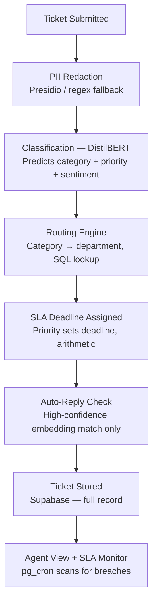
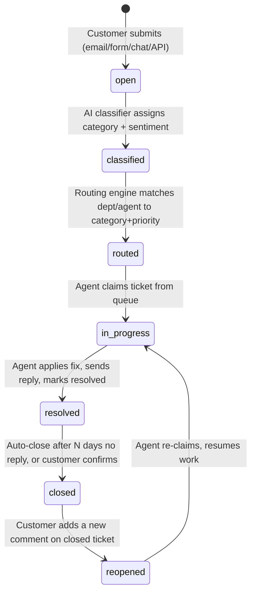

# Architecture — AI-Based Customer Support Ticket System

## 1. System Overview

An intelligent helpdesk that automates ticket ingestion, AI-based classification, rule-based routing, SLA monitoring/escalation, and retrieval-based auto-reply. Tickets arrive from multiple channels (email, chatbot, web form, API); the system determines category/priority, routes to the correct department, offers instant AI-generated responses for common issues, monitors SLAs with auto-escalation, and assists agents.

**Objectives**

- Automate customer ticket classification
- Reduce manual ticket triage
- Improve ticket routing accuracy
- Provide instant AI-generated responses for common issues
- Monitor SLAs and auto-escalate overdue tickets
- Improve customer satisfaction through faster response times

## 2. Tech Stack (locked)

| Layer                | Technology             | Notes                                                       |
| -------------------- | ---------------------- | ----------------------------------------------------------- |
| Frontend             | React.js + TailwindCSS | Customer UI + Agent dashboard                               |
| Backend              | FastAPI                | Business logic **and** AI integration in one process        |
| Database             | Supabase (PostgreSQL)  | Includes `pgvector` for embedding-based auto-reply matching |
| Classification model | Fine-tuned DistilBERT  | Not an LLM API call — local inference inside FastAPI        |
| Scheduling           | `pg_cron` (Supabase)   | SLA breach scanning                                         |
| Monitoring           | Sentry                 | Backend + frontend error tracking                           |

## 3. User Roles

| Role                | Capabilities                                                                         |
| ------------------- | ------------------------------------------------------------------------------------ |
| Customer / End User | Raises tickets, tracks status, receives auto-responses                               |
| Support Agent       | Views assigned tickets, gets AI-suggested replies & summaries, updates ticket status |
| Admin               | Manages users, categories, SLA policies, views system-wide analytics                 |

## 4. Component Communication

```
┌─────────────┐                    ┌──────────────────────────────┐                    ┌──────────────┐
│ Customer UI │──POST /tickets─────│           FastAPI            │──INSERT/SELECT─────│   Supabase   │
│  (React)    │                    │  (business logic + AI, one   │                    │ (PostgreSQL) │
│             │──ticket status─────│   service, one deploy)       │───rows─────────────│              │
└─────────────┘                    └───────────┬──────────────────┘                    └──────┬───────┘
                                                │                                             │
                                    internal fn calls:                                        │
                                    1. redact_pii(text)                                       │
                                    2. classify_ticket(text) → DistilBERT                     │
                                    3. route_ticket(category) → SQL lookup                    │
                                    4. calc_sla_deadline(priority) → arithmetic               │
                                    5. suggest_reply(text) → pgvector similarity              │
                                    6. persist_ticket(...) → Supabase client                  │
                                                                                              │
                                                                                    pg_cron scans SLA breaches, auto-escalates
```

All AI/NLP functions (`redact_pii`, `classify_ticket`, `suggest_reply`) are **internal function calls inside the one FastAPI process** — never separate services, never exposed as independent public endpoints.

## 5. Ticket Processing Pipeline

Every ticket flows through eight stages, in this order, on every submission:



| Stage                           | What happens                                                                                                                                                                                                                                          | AI or deterministic?                            |
| ------------------------------- | ----------------------------------------------------------------------------------------------------------------------------------------------------------------------------------------------------------------------------------------------------- | ----------------------------------------------- |
| 5.1 Ticket Submitted            | Customer submits via React UI. Raw text, subject, metadata (timestamp, customer ID) sent to FastAPI.                                                                                                                                                  | —                                               |
| 5.2 PII Redaction               | Text stripped of emails, phone numbers, card numbers, names via Presidio (or regex fallback) **before** it touches the model or the DB.                                                                                                               | Deterministic / rule-based NLP                  |
| 5.3 Classification (DistilBERT) | Redacted text tokenized and passed through the fine-tuned model → predicts category, priority, sentiment.                                                                                                                                             | AI                                              |
| 5.4 Routing Engine              | Predicted category → department via a lookup table in Supabase. No model call — kept separate so routing rules can change without retraining.                                                                                                         | Deterministic                                   |
| 5.5 SLA Deadline Assigned       | Deadline computed from priority via `sla_policies` lookup + arithmetic, stored on the ticket record.                                                                                                                                                  | Deterministic                                   |
| 5.6 Auto-Reply Check            | Redacted text embedded (`sentence-transformers`, e.g. `all-MiniLM-L6-v2`), compared against a reference bank via `pgvector` cosine similarity. Reply only surfaced above a confidence threshold; otherwise the ticket proceeds to the agent normally. | AI (embedding) + deterministic (threshold gate) |
| 5.7 Ticket Stored               | Full record — text, category, department, SLA deadline, auto-reply (if any) — persisted to Supabase.                                                                                                                                                  | —                                               |
| 5.8 Agent View + SLA Monitoring | Agent dashboard shows the ticket to the assigned department. `pg_cron` periodically scans for SLA breaches and auto-escalates independent of agent action.                                                                                            | Deterministic                                   |

**Rule:** classification/embedding/redaction are model-driven; routing and SLA math are always deterministic SQL lookup or arithmetic. Never replace routing or SLA logic with a model call.

## 6. Ticket Lifecycle — State Machine



| Transition             | Trigger actor             | Fires when                                                                                                       |
| ---------------------- | ------------------------- | ---------------------------------------------------------------------------------------------------------------- |
| → open                 | Customer                  | Ticket submitted via email/form/chat/API                                                                         |
| open → classified      | AI classifier             | Category + sentiment assigned. **Low-confidence prediction → routed to human review instead of auto-proceeding** |
| classified → routed    | Routing engine            | Dept/agent lookup matched to category + priority                                                                 |
| routed → in_progress   | Agent                     | Agent claims ticket from queue                                                                                   |
| in_progress → resolved | Agent                     | Fix applied, reply sent, agent marks resolved                                                                    |
| resolved → closed      | System (auto) or customer | Auto-close after N days no reply, or customer confirms fix                                                       |
| closed → reopened      | Customer                  | New comment posted on a closed ticket                                                                            |
| reopened → in_progress | Agent                     | Agent re-claims, resumes work                                                                                    |

**Edge cases baked into the design:**

- Low classification confidence (`tickets.classification_confidence` below threshold) → human review branch, never auto-processed.
- AI service outage → fallback to manual ticket assignment; system must remain functional without the model.
- Auto-reply below similarity threshold → no reply shown, ticket proceeds through the normal agent path.

## 7. Database Schema

### 7.1 Core tables

```sql
CREATE TABLE departments (
  id UUID PRIMARY KEY DEFAULT gen_random_uuid(),
  name TEXT UNIQUE NOT NULL
);

CREATE TABLE categories (
  id UUID PRIMARY KEY DEFAULT gen_random_uuid(),
  name TEXT UNIQUE NOT NULL,
  description TEXT
);

CREATE TABLE users (
  id UUID PRIMARY KEY DEFAULT gen_random_uuid(),
  email TEXT UNIQUE NOT NULL,
  password_hash TEXT NOT NULL,
  role user_role NOT NULL DEFAULT 'customer',
  department_id UUID REFERENCES departments(id),
  created_at TIMESTAMPTZ NOT NULL DEFAULT now()
);

CREATE TABLE routing_rules (
  id UUID PRIMARY KEY DEFAULT gen_random_uuid(),
  category_id UUID NOT NULL REFERENCES categories(id),
  department_id UUID NOT NULL REFERENCES departments(id),
  UNIQUE(category_id, department_id)
);

CREATE TABLE sla_policies (
  id UUID PRIMARY KEY DEFAULT gen_random_uuid(),
  priority ticket_priority UNIQUE NOT NULL,
  response_minutes INT NOT NULL,
  resolution_minutes INT NOT NULL
);

CREATE TABLE tickets (
  id UUID PRIMARY KEY DEFAULT gen_random_uuid(),
  customer_id UUID NOT NULL REFERENCES users(id),
  category_id UUID REFERENCES categories(id),
  department_id UUID REFERENCES departments(id),
  assigned_agent_id UUID REFERENCES users(id),
  priority ticket_priority,
  sentiment ticket_sentiment,
  status ticket_status NOT NULL DEFAULT 'open',
  subject TEXT NOT NULL,
  body_redacted TEXT NOT NULL,
  classification_confidence NUMERIC(4,3),
  created_at TIMESTAMPTZ NOT NULL DEFAULT now(),
  updated_at TIMESTAMPTZ NOT NULL DEFAULT now()
);

CREATE TABLE sla_state (
  id UUID PRIMARY KEY DEFAULT gen_random_uuid(),
  ticket_id UUID UNIQUE NOT NULL REFERENCES tickets(id),
  sla_policy_id UUID NOT NULL REFERENCES sla_policies(id),
  response_due_at TIMESTAMPTZ NOT NULL,
  resolution_due_at TIMESTAMPTZ NOT NULL,
  first_response_at TIMESTAMPTZ,
  resolved_at TIMESTAMPTZ,
  breached BOOLEAN NOT NULL DEFAULT false,
  escalated_at TIMESTAMPTZ
);

CREATE TABLE replies (
  id UUID PRIMARY KEY DEFAULT gen_random_uuid(),
  ticket_id UUID NOT NULL REFERENCES tickets(id),
  author_id UUID REFERENCES users(id),
  is_auto_reply BOOLEAN NOT NULL DEFAULT false,
  body TEXT NOT NULL,
  created_at TIMESTAMPTZ NOT NULL DEFAULT now()
);
```

**Notes:**

- `tickets.body_redacted` confirms PII redaction happens before storage — never add a raw-text column.
- `tickets.classification_confidence` drives the low-confidence → human-review branch.
- `routing_rules` and `sla_policies` encode deterministic, non-AI business logic — edit these to change routing/SLA behavior; never retrain a model for it.

```

## 8. AI / Business-Logic Boundary

| Concern | Owner | Type |
|---|---|---|
| PII redaction | `redact_pii()` | Rule-based NLP (Presidio/regex) |
| Category + priority + sentiment | `classify_ticket()` — DistilBERT | AI (local fine-tuned model, not LLM API) |
| Department assignment | `route_ticket()` | Deterministic SQL lookup |
| SLA deadline | `calc_sla_deadline()` | Deterministic arithmetic |
| Auto-reply suggestion | `suggest_reply()` | AI embedding similarity + deterministic confidence gate |
| SLA breach detection | `pg_cron` job | Deterministic, idempotent (safe against overlapping cron runs) |

Keeping routing and SLA math deterministic (not model-driven) means routing rules and SLA durations can be edited in the `routing_rules` / `sla_policies` tables without retraining or redeploying the classifier.

## 9. Human Oversight & Fallback Rules

- Low-confidence classification → human review, never auto-processed.
- AI-generated replies still require human check on sensitive cases.
- If the AI service (DistilBERT inference) fails, the system falls back to manual ticket assignment rather than blocking ticket intake.

## 10. Testing Strategy (summary)

| Category | Focus |
|---|---|
| Unit | Auth, ticket CRUD, classification/priority assignment, routing, SLA calc, DB validation |
| Integration | React ↔ FastAPI, FastAPI ↔ Supabase, backend ↔ model, ticket ↔ knowledge base, SLA monitor |
| Functional | Full lifecycle: creation → classification → priority → routing → response → resolution → closure |
| AI Model | Classification/routing/sentiment accuracy, auto-reply relevance, % requiring human correction |
| Security | RBAC, unauthorized ticket access, API rate limiting, password/API-key storage, PII protection |
| Performance | Submission latency, classification latency, dashboard load, concurrent users, DB scaling |
| UAT | Role-based usability across customer, agent, admin |

## 11. Decision Rules (for ambiguous cases)

1. Preserve the locked stack (§2) — single FastAPI service, no Express layer.
2. Preserve exactly three user roles (§3).
3. Enforce the state machine (§6) for any status change.
4. Preserve the AI/business-logic boundary (§8) — never replace deterministic routing/SLA logic with a model call.
5. Redact PII before storage or classification (§5.2) — never store or log raw ticket text.
6. Route low-confidence classifications to human review (§9), not auto-proceed.
7. If a detail isn't defined here, treat it as an open design decision — label proposals as recommendations, not requirements.

---
*Generated from the project's locked architecture skill + submitted pipeline/state-machine diagrams. Update this file (and the skill) together when the schema reconciliation in §7 is resolved.*
```
